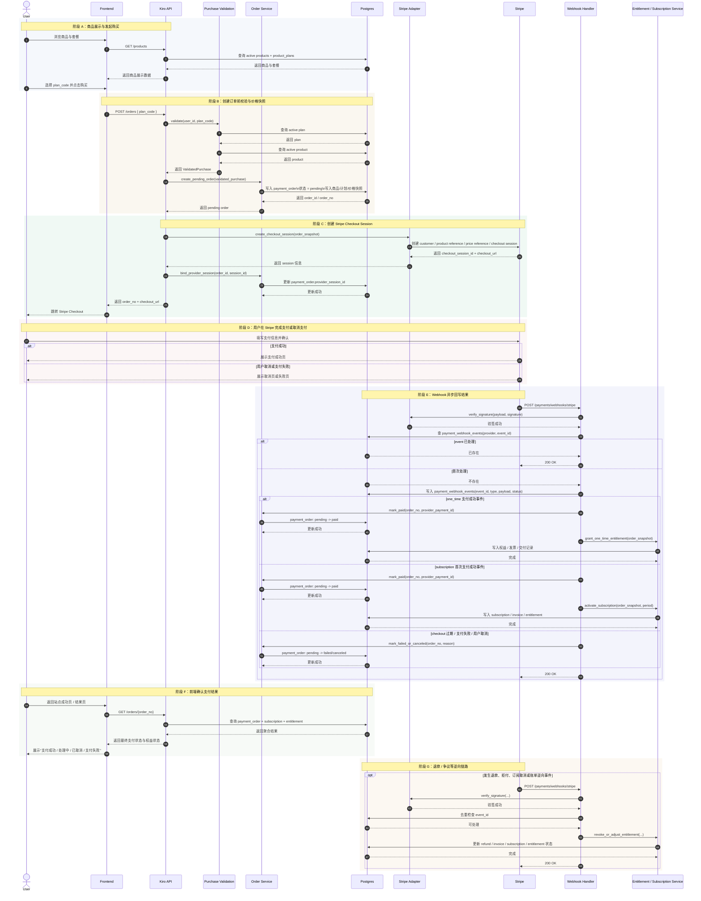

# Kiro 支付流程时序图

## 1. 文档目的

本文档用于描述 Kiro 项目中“用户购买商品并完成支付”的目标流程时序。

- 本文档是面向当前项目规划的目标设计稿，不代表仓库中已经全部实现。
- 当前优先描述 Stripe 作为首个支付渠道的完整链路。
- 如果后续接入 Creem，整体编排可保持一致，只替换支付提供方适配器与对应 webhook 事件。

## 2. 适用范围

本文档覆盖以下阶段：

- 商品展示与用户发起购买
- 下单前购买资格校验
- 创建支付订单与价格快照
- 跳转 Stripe Checkout 完成支付
- Stripe Webhook 回写支付结果
- 支付成功后开通订阅或发放一次性权益
- 前端查询订单结果
- 退款 / 争议等逆向链路

## 3. 参与者

- `User`：终端用户
- `Frontend`：前端站点或客户端
- `Kiro API`：统一业务接口层
- `Purchase Validation`：购买前置校验层
- `Order Service`：订单与支付状态编排层
- `Postgres`：订单、商品、订阅、账单等持久化存储
- `Stripe Adapter`：Stripe SDK / API 适配层
- `Stripe`：Stripe 平台
- `Webhook Handler`：Stripe 回调验签、去重与事件路由层
- `Entitlement / Subscription Service`：权益开通与订阅状态维护层

## 4. 主时序图

## 5. 关键状态说明

### 5.1 订单状态建议

- `pending`：订单已创建，尚未确认支付结果。
- `paid`：已确认支付成功。
- `failed`：支付失败。
- `canceled`：用户取消、会话过期，或被业务主动关闭。
- `refunded`：已退款，通常由逆向流程驱动。

### 5.2 设计重点

- 下单时必须写入商品、计划、金额、币种、收费方式等快照，避免后续商品改价影响历史订单。
- 前端跳转成功页不能直接视为支付成功，最终状态必须以 webhook 异步回写为准。
- webhook 处理必须具备验签、去重、幂等更新和可重复消费能力。
- 订阅型商品与一次性商品应共享“下单与支付确认”主链路，但在支付成功后的履约动作不同。
- 退款、争议、取消订阅、续费失败等逆向事件也必须通过统一 webhook 编排进入状态机。

## 6. 建议落地接口

如果按当前项目路线推进，建议优先落地以下接口：

- `GET /products`
- `GET /products/{product_code}`
- `POST /orders`
- `GET /orders/{order_no}`
- `POST /payments/webhooks/stripe`

## 7. 推荐实施顺序

结合当前仓库进度，建议按以下顺序实现：

1. 补齐支付订单表与价格快照模型。
2. 在 `kiro-api` 中实现 `POST /orders`，接入购买前置校验层。
3. 实现 Stripe Adapter 与 Checkout Session 创建。
4. 实现 Stripe Webhook 验签、去重、事件分发。
5. 实现支付成功后的订阅开通 / 一次性权益发放。
6. 实现 `GET /orders/{order_no}` 供前端结果页轮询与确认。
